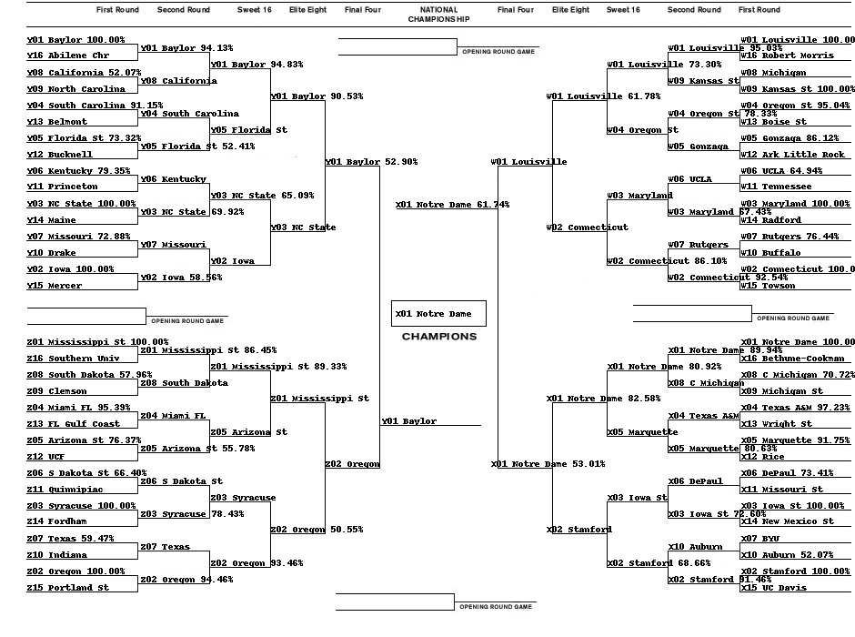
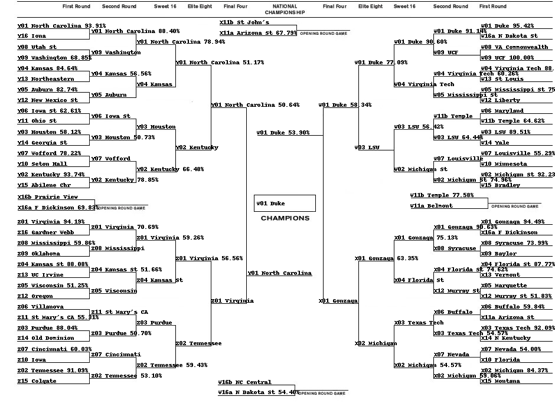

# Kaggle March Madness 2019

These are my solutions for the 2019 session of the so-called "March Madness" basketball tournament. I made a submission for women as well as for men. The models are very similar for both genders but there are a few differences. To run this solution yourself you'll want to want to put the data available from Kaggle and dump it in the appropriate directory. For example for women you can download the data from [here](https://www.kaggle.com/c/womens-machine-learning-competition-2019/data) and dump it in the `data/women` directory. Likewise there is one notebook for women, and one for men. The notebooks aren't heavy on comments but I made a point of writing idiomatic and readable code, so you shouldn't have too much difficulty in going through them.

Here are my predicted brackets for women (made with [bracketeer](https://github.com/cshaley/bracketeer/)):

And here they are for men:

